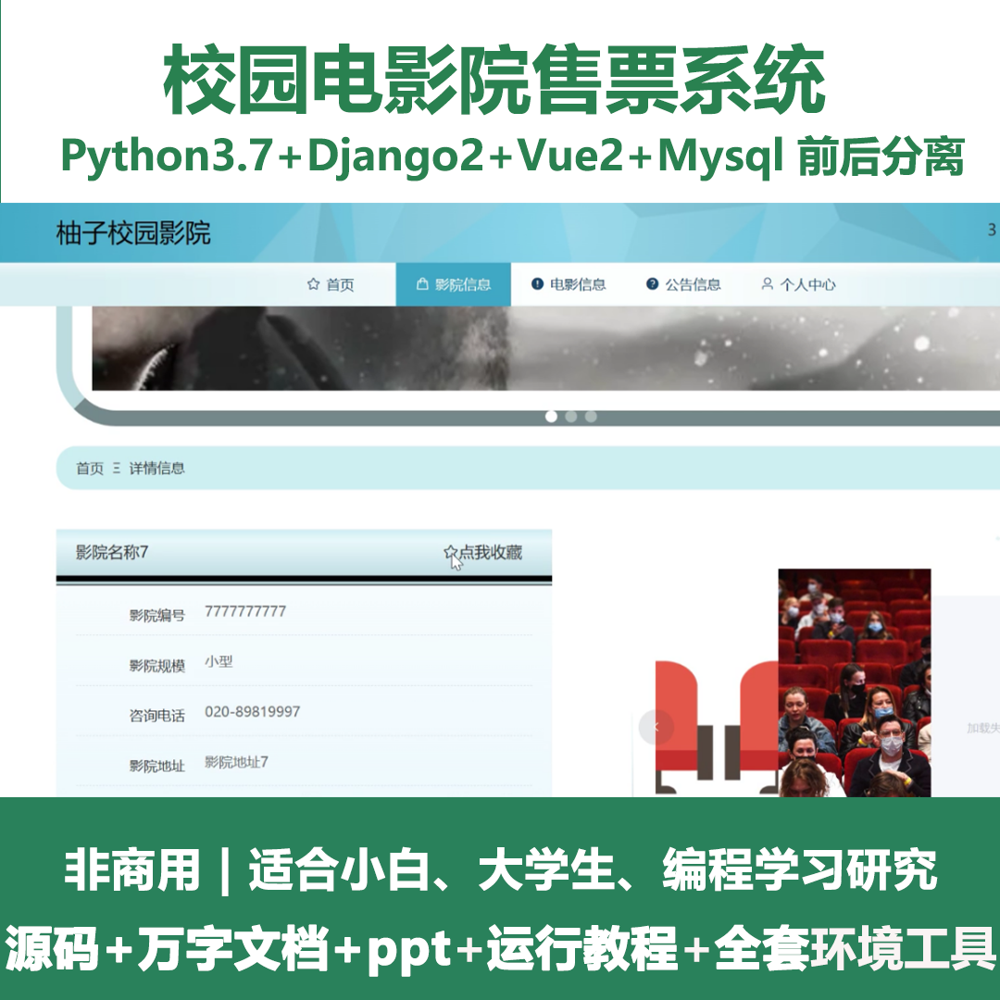
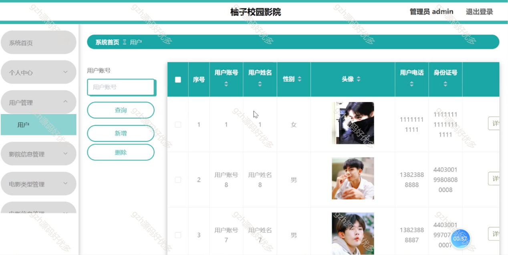
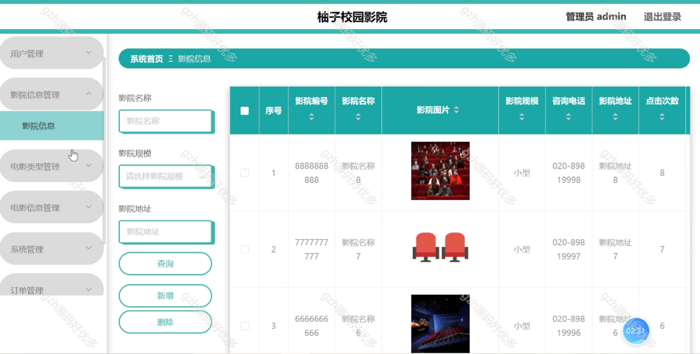
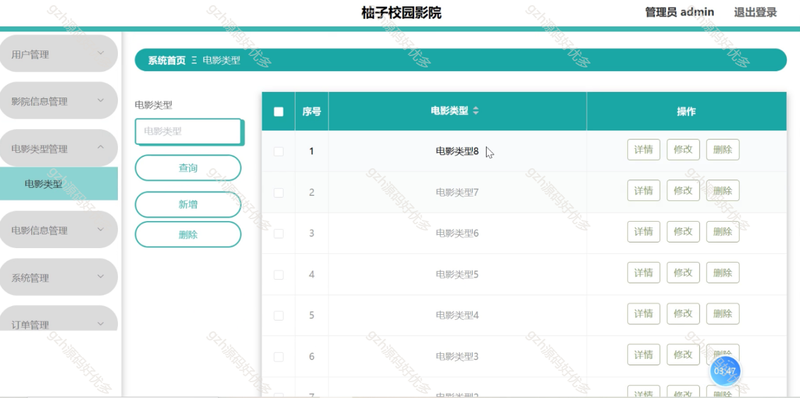
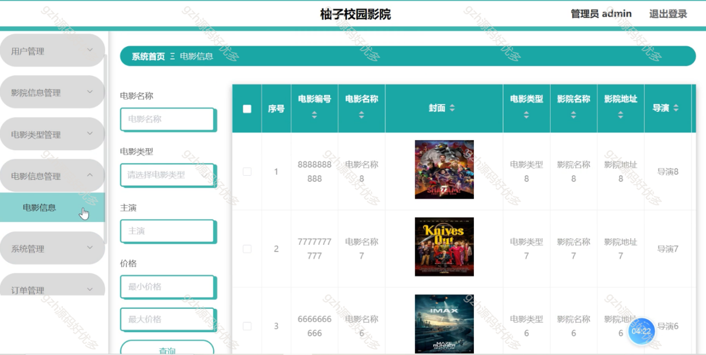
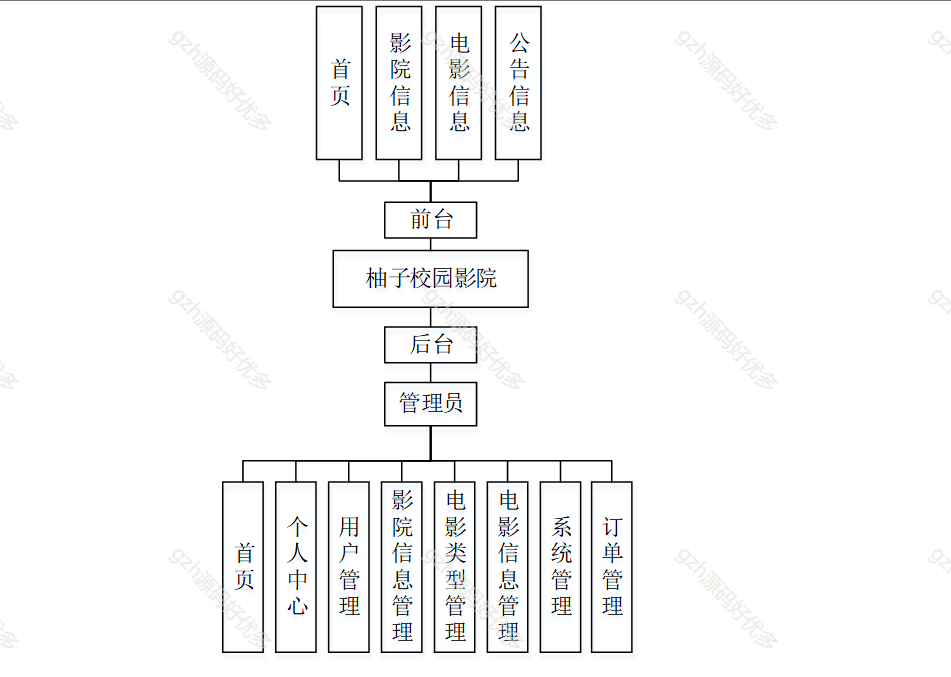
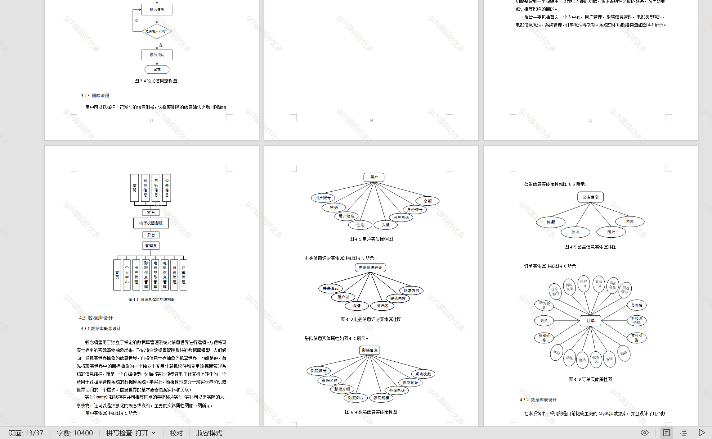

 
## 查看主页获取源码

### 一、关键词

校园电影院售票系统、电影院系统

 

### 二、作品包含

源码+数据库+设计文档万字+PPT+全套环境和工具资源+部署教程

 

### 三、项目技术

前端技术：Html、Css、Js、Vue2.0、Element-ui
后端技术：Python3.7、Django2.0

  

 

### 四、运行环境（以下版本亲测，其他版本未知，请自测）

开发工具：PyCharm + VSCODE

数据库：MySQL5.7（最低要5.7版本）

数据库管理工具：Navicat10+

Python：Python3.7

前端Nodejs：14

浏览器：谷歌浏览器

 

### 五、项目介绍

项目编号：python028

随着社会的不断进步与发展，人们对生活质量要求逐步提升。如果开发一款柚子校园影院，可以让管理员和用户在最短的时间里享受到最好的服务；而开发本系统，又能够提高系统整体工作水平，简化工作程序，这对管理员和用户来说都是一件非常乐意的事情。

柚子校园影院系统前台提供首页、影院及电影信息、公告浏览，后台管理员可进行首页、个人中心、用户、影院信息、电影类型及信息、系统、订单等管理，实现校园影院运营全流程管控 。

 

### 六、运行截图

